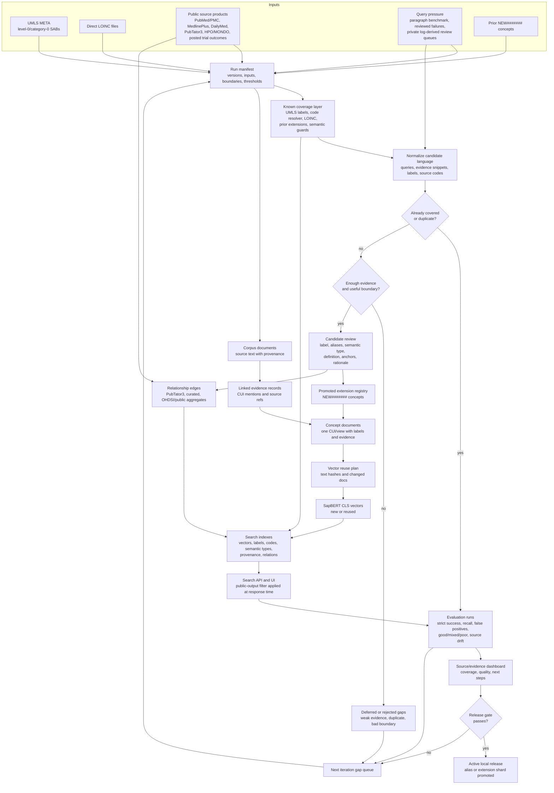

# New UMLS Iteration Loop

Last updated: 2026-06-08

This file defines the operating loop for building a broadly useful biomedical
search interface and vector store on top of an open UMLS seed plus local
`NEW#######` extension concepts.

## Product Goal

Build a search system that clinicians, researchers, and terminology maintainers
can use for real biomedical language. The system must be:

- Broadly useful: handles common clinical notes, research abstracts, source
  codes, LOINC observations, abbreviations, procedures, findings, therapies, and
  relationship-oriented queries.
- Updatable: every run has a manifest, stable inputs, versioned outputs, and a
  clear release decision.
- Extensible: new `NEW#######` concepts, aliases, evidence, and MTH-style
  broader/narrower assertions can be added without rebuilding everything.
- Documentable: each concept and index change has enough provenance for a person
  to understand why it exists and how it was produced.

## Pipeline Diagram



Read the diagram as a gated loop, not a one-way ETL job. Source products and
UMLS/LOINC identity data create searchable artifacts, but evaluation determines
whether those artifacts are promoted, held for review, or routed back into the
next gap queue.

## Current Decisions

- Base UMLS subset: use source vocabularies identified in `MRSAB.RRF` as
  UMLS restriction level 0 / category 0. Each run must persist the selected SABs
  and UMLS release when those files are part of the run.
- LOINC: use UMLS level-0 LOINC content where present and direct LOINC files
  supplied separately. Preserve raw codes/names and produce clearer clinical
  observation display names as a product layer, not as proof that a new concept
  exists.
- New local CUIs: use `NEW#######` identifiers. These are local product CUIs,
  not NLM-assigned UMLS CUIs.
- Weak-area focus: clinically relevant missing or poorly bounded concepts,
  especially observations/results, phenotypes, procedures, clinician shorthand,
  treatment response, safety/toxicity patterns, and procedure concepts weakened
  by the absence of CPT in the open subset.
- Evaluation: Codex/LLM evaluation is part of the loop. Human feedback is useful
  but not required before creating a local CUI.
- Threshold policy: start conservative, then lower thresholds only when the last
  iteration shows acceptable precision and good duplicate control.
- Fast regression smoke test: keep `config/search_quality_paragraph_queries.tsv`
  as the mandatory judged query pool. It currently contains 167 query rows plus
  the header. Normal improvement loops should run a rotating 50-query sample
  from that pool for speed; use the full pool only for deliberate release or
  exhaustive checks.
- Synthetic query corpus: use 10,000 typical clinical, research, trial-result,
  drug-label, lay-language, and diagnostic-report queries for repeatable search
  pressure. Current set: `config/typical_clinical_research_sentences.tsv`.
- Page-length stress corpus: use 200 full-page pasted-note/query samples to
  test long-input ranking, negation, copied-forward context, and incidental
  background concepts. Current set: `config/full_page_sample_queries.tsv`.

## Fast Regression Smoke Test

Use a rotating 50-query paragraph sample for normal candidate rebuilds:

```bash
python3 scripts/run_search_quality_experiment.py \
  --queries config/search_quality_paragraph_queries.tsv \
  --query-limit 50 \
  --query-selection rotate \
  --search-system api \
  --scope umls_evidence \
  --fail-gates
```

Pass `--query-limit 0` only when you intentionally want the full judged pool.

Run `--search-system umls-only` for the in-process UMLS baseline, or
`--search-system both` to emit adjacent UMLS-only and current-search columns in
the experiment report. Use `--scope umls` when the live API should be exercised
without evidence expansion.

The smoke run's primary metric is strict success@10: top result on target, all
expected or acceptable CUIs present in the first 10 results, and no known
false-positive CUI in the first 10.

## Source Delta Checks

Every source rebuild must produce a source-delta record before release. At
minimum, record these fields per source and compare them with the previous
retained rebuild:

- Source identity: URL, source version, source date or release date, fetch date,
  and content hash.
- Records fetched.
- Records changed, added, and removed.
- CUIs gained and lost.
- Relationship edges gained and lost.
- Top source changes for benchmark queries, especially changes in the first 10
  results from the rotating smoke sample, the full judged pool when run, and the
  source-specific benchmark rows.

Unexpected source-count collapses are release blockers unless the rebuild
manifest explains the intended source removal and the benchmark impact is
reviewed.

Source presence alone is not a quality metric. Each search-quality run also
writes `source_quality_at_10.json` and `source_quality_at_10.tsv`, which tie
sources to judged outcomes:

- Queries where the source appears in the top 10.
- Strict-success queries where the source appears in the top 10.
- Queries where the source is attached to an expected or acceptable hit.
- Strict-success queries where the source is attached to an expected or
  acceptable hit.
- Queries where the source is attached to a known false-positive hit.
- Top-1 expected-hit contribution and mean best expected rank.

Use these as associative contribution metrics, not causal ablations. A source
earns useful credit when it is attached to the acceptable CUI hit, not merely
when it appears somewhere in a passing result page.

Use `scripts/check_source_rebuild_delta.py` to validate the required fields and
compare a current source manifest with the previous retained manifest:

```bash
python3 scripts/check_source_rebuild_delta.py \
  --previous build/source_manifests/previous.json \
  --current build/source_manifests/current.json \
  --out build/source_manifests/source_delta_report.json
```

## Source Benchmarks

In addition to the rotating smoke sample, source rebuilds must run the matching
source-specific benchmark file from `config/source_specific_benchmarks.tsv`:

- PubTator3: relationship correctness,
  `config/source_benchmarks/pubtator3_relationship_correctness.tsv`.
- ClinicalTrials.gov: posted outcome-result queries only,
  `config/source_benchmarks/clinicaltrials_posted_outcomes.tsv`.
- DailyMed: drug indication, warning, and adverse-reaction queries,
  `config/source_benchmarks/dailymed_drug_label_queries.tsv`.
- MedlinePlus: lay-language condition queries,
  `config/source_benchmarks/medlineplus_lay_condition_queries.tsv`.
- PubMed/PMC: literature-backed disease, drug, and procedure queries,
  `config/source_benchmarks/pubmed_pmc_literature_queries.tsv`.

These are source-focused gates, not replacements for the stable smoke set.

### Locked PubMed Abstract Benchmark

The long-abstract PubMed check is separate from the clinical smoke score because
topic-level expected CUIs can make fetched abstracts look worse or better than
they really are. Do not score PubMed abstracts with inherited topic-level
expectations. Every scored PubMed abstract must have an approved per-PMID row in
`config/pubmed_literature_abstract_curation.tsv`.

Use the strict generator to create scored query files:

```bash
python3 scripts/fetch_pubmed_paragraph_queries.py \
  --topics config/pubmed_paragraph_topics.tsv \
  --curation config/pubmed_literature_abstract_curation.tsv \
  --strict-curation \
  --output-dir build/pubmed_literature_benchmark_seed
```

This writes separate `pubmed_literature_dev_queries.tsv` and
`pubmed_literature_heldout_queries.tsv` files. Tune against the dev split only;
run the held-out split as a separate report and keep it out of the clinical
smoke headline. Use `config/pubmed_literature_candidate_topics.tsv` to fetch a
larger 50-100 abstract review queue, then promote only reviewed per-abstract
rows into the curation file. See `docs/pubmed_literature_benchmark.md`.

## Progress Metrics

Every iteration should report the same percentages so we can see whether the
system is getting better:

- Query-term coverage: pre-existing exact coverage, extension coverage, new
  CUI coverage, deferred terms, and unresolved clinically relevant gaps.
- Search quality: top-1 relevance, expected CUI recall at 5/10/20/60,
  semantic-group coverage, weighted precision at 5, MRR, and the most common
  failure categories.
- Result usefulness: paragraph-level `good` / `mixed` / `poor` judgments that
  answer whether the returned concepts are clinically useful, not merely
  present somewhere in the payload.
- Vector-store freshness: changed concept documents, changed vectors, loaded
  vector count, alias/index version, and whether old vectors were retired.
- Concept growth: new CUIs, carried-forward CUIs, rejected duplicates, semantic
  equivalence guards, and concepts needing review.
- Relationship growth: MTH `RB`/`RN` rows, close matches, related anchors, and
  relation assertions needing spot check.
- LOINC usefulness: direct LOINC exact matches, observation display-name rows,
  and terms rescued by LOINC-derived naming.
- Documentation completeness: manifest, report, candidate review, relation
  review, search payloads, and test summary present for the run.

## Efficient Iteration Contract

Each iteration has one primary purpose. Do not mix too many goals in one pass.
Good purposes are:

- Improve coverage in one weak slice, such as clinical results or procedures.
- Add a batch of high-confidence concepts.
- Improve LOINC display-name normalization.
- Load an extension vector shard into the search alias.
- Fix a ranking or provenance failure found by evaluation.
- Refactor the pipeline after repeated changes.

The default cadence is:

1. Carry forward prior extension concepts as existing coverage.
2. Run the same query set to measure regression.
3. Identify the biggest remaining gap by slot/domain.
4. Add only changes that directly improve that gap.
5. Rebuild the smallest affected artifacts.
6. Re-run tests and write a release decision.

## Iteration Steps

1. Freeze the run manifest.
   Record input artifacts, prior extension registries, UMLS/LOINC versions,
   PubMed shards, restricted-data boundaries, embedding model, vector index
   names, thresholds, and code revision when available.

2. Load known concept coverage.
   Load the level-0 UMLS label index, code resolver index, direct LOINC lookup,
   and all promoted `NEW#######` concepts from prior iterations.

3. Normalize candidate language.
   Normalize clinical/research sentences, failed queries, LOINC observation
   names, and evidence snippets. Before CUI creation, check exact labels, source
   codes, direct LOINC names, prior extension labels, and curated semantic
   equivalence guards.

4. Search and evaluate.
   Run the stable query set through the current search interface when available.
   Save payloads and grade the output using the same rubric: relevant, partial,
   wrong, unsupported, missing concept, bad label, bad semantic type, bad
   ranking, or provenance problem.
   Also assign each paragraph a `good`, `mixed`, or `poor` verdict. `Good`
   means the central concepts from the main semantic groups are visible in the
   first page and the top result is clinically on target. `Mixed` means the
   right concepts are recoverable but ranking, semantic typing, or omissions
   would slow a reviewer down. `Poor` means a central concept is absent from
   the first useful result window or the returned set has the wrong clinical
   focus.

5. Mine unresolved gaps.
   For unresolved terms, require both query pressure and evidence support. Favor
   concepts that are clinically useful as search targets, relation nodes, or
   result filters.

6. Compare against existing concepts.
   Reject spelling, punctuation, word-order, acronym-expansion, and obvious
   semantic-equivalent variants. Record close-match and broader anchors when the
   existing concept is useful but insufficient.

7. Promote high-confidence `NEW#######` concepts.
   Emit preferred label, aliases, semantic type, definition, evidence, source
   provenance, anchors, status, rationale, and iteration metadata.

8. Update relationships.
   Add MTH `RB`/`RN` broader/narrower rows only where the hierarchy is clear.
   Use close-match anchors for near-equivalents or adjacent concepts that should
   not be asserted as hierarchy.

9. Rebuild affected vector/search artifacts.
   Build concept documents and vectors for changed concepts. Load them into a
   versioned vector index or extension shard. Move aliases only after evaluation
   passes.

10. Document the run.
    Write the manifest, report, term evaluation, candidate review, relation
    quality file, vector/reindex decision, test output, and next-step notes.

11. Refactor periodically.
    Every few iterations, clean repeated code, add tests around new behavior,
    and update the technical pipeline docs.

## Release Gates

An iteration can be released to the active search interface only when:

- The rotating 50-query smoke run completes and strict success@10 does not drop
  beyond the configured small tolerance. For release promotion, also run the
  full judged pool with `--query-limit 0`.
- Known false positives do not increase.
- Evidence mode contains no protocol-only ClinicalTrials.gov text; only posted
  outcome-result text can contribute trial evidence.
- Public display payloads expose no restricted, private, licensed-only, or
  non-level-0 UMLS/source content.
- No unexpected source-count collapse is present in the source-delta record or
  the top-10 source mix from the benchmark payloads.
- Existing high-value queries do not regress.
- New or changed concepts have concept documents and vectors.
- The search alias or extension shard can be rolled back.
- The manifest says exactly which artifacts were loaded.
- The manifest records source URL/version/date/hash, records fetched, records
  changed, CUIs gained/lost, relationship edges gained/lost, and benchmark query
  source changes for each rebuilt source.
- Matching source-specific benchmark suites pass for rebuilt evidence sources.
- Candidate and relation review artifacts exist.
- Tests covering changed code pass.

If a run creates concepts but does not load them into the active vector store,
the report must say so explicitly.

## Minimum Output Per Iteration

- Input manifest
- Prior-extension coverage record
- Corpus/evidence artifact manifest
- Term evaluation TSV/JSONL
- Candidate review TSV/Markdown
- Promoted `NEW#######` concept registry
- Extension concept documents and evidence JSONL
- MTH relation JSONL/SQLite when relations are emitted
- Search payload archive when a live search interface is evaluated
- Vector/reindex/release decision note
- Test summary

## Promotion Threshold

Create a new local CUI only when most of the following are true:

- The candidate is clinically useful as a search target, result, or relation
  node.
- Evidence appears across repeated examples or multiple independent source
  contexts.
- The concept boundary is more specific than a generic phrase but broader than a
  one-off sentence.
- Existing level-0 UMLS, direct LOINC, and prior `NEW#######` concepts do not
  represent the idea cleanly.
- A preferred label and short definition can be written without contorting the
  evidence.
- At least one broader, related, or close-match anchor can be recorded when a
  reasonable anchor exists.
- Adding the concept should improve retrieval or coverage in a known weak area.

Lower thresholds only for a named weak slice and only after adding duplicate
guards for the variants found in the previous run.

## Explicit Non-Goals

- Do not create new CUIs for capitalization, punctuation, pluralization, word
  order, spelling-only variants, or trivial modifiers.
- Do not create a local CUI when a semantic-equivalent level-0 concept already
  covers the phrase well enough for search.
- Do not treat direct LOINC display-name cleanup as proof that a new clinical
  concept exists.
- Do not publish `NEW#######` concepts as official NLM UMLS CUIs.
- Do not mix restricted clinical text into public artifacts.

## Completed Iterations

- `iteration_001_existing_data`: existing-data-only pass using generated
  clinical/research sentences, the current UMLS label/code indexes, direct
  LOINC 2.82, five public topic concept-document chunks, and the latest reviewed
  PubMed bulk shard. It created 10 high-support local `NEW#######` concepts
  after treating exact code-resolver matches such as `diuresis` as existing
  coverage. It also emits local MTH `RB`/`RN` broader/narrower assertions where
  a defensible broader UMLS anchor exists and writes direct LOINC display-name
  artifacts for the clinical-observation naming pass. Report:
  `build/new_umls_iterations/iteration_001_existing_data/iteration_report.md`.
- `iteration_002_existing_data`: existing-data-only pass that carries forward
  the 10 promoted iteration 001 concepts as local coverage, adds curated
  semantic-equivalent guards for obvious variants, modestly lowers the support
  threshold for the next weak-slice pass, and creates 3 additional
  `NEW#######` concepts. It writes both incremental and cumulative extension
  concept artifacts so downstream vector indexing can load only the delta or the
  full current local extension layer. Report:
  `build/new_umls_iterations/iteration_002_existing_data/iteration_report.md`.
- `iteration_003_search_quality`: existing-data-only search-quality pass that
  embeds and loads the 13 cumulative local extension concepts into the active
  search path, adds deterministic label fallback for loaded `NEW#######`
  concepts, and fixes ranking failures found by the paragraph tests. It creates
  no new CUIs. Report:
  `build/new_umls_iterations/iteration_003_search_quality/iteration_report.md`.
- `iteration_004_search_quality_intent`: existing-data-only search-quality pass
  that adds paragraph-intent ranking signals, demotes comparator-arm concepts in
  cohort/comparative-study wording, and fixes structured-statement linking for
  repeated phrase occurrences. It creates no new CUIs. Report:
  `build/new_umls_iterations/iteration_004_search_quality_intent/iteration_report.md`.
- `iteration_005_semantic_types_and_quality`: existing-data-only pass that
  hydrates semantic types for promoted `NEW#######` CUIs, enables default UMLS
  label fallback, expands the paragraph benchmark to 20 examples, and adds
  explicit `good` / `mixed` / `poor` usefulness evaluation. It creates no new
  CUIs. Report:
  `build/new_umls_iterations/iteration_005_semantic_types_and_quality/iteration_report.md`.
- `iteration_006_exact_mentions`: existing-data-only pass that improves
  first-page exact-mention handling, suppresses low-value single-token label
  artifacts, and preserves semantic grouping for label-only fallback hits. It
  improves the stable paragraph benchmark to 11 `good`, 9 `mixed`, and 0
  `poor` outputs. It creates no new CUIs. Report:
  `build/new_umls_iterations/iteration_006_exact_mentions/iteration_report.md`.
- `iteration_007_more_paragraphs`: existing-data-only pass that expands the
  paragraph benchmark from 20 to 32 examples, adds short biomedical acronym
  handling, and narrows exact medication ranking so administered drugs stay
  visible without treating lab analytes as drugs. It corrects benchmark targets
  where the sentence wording pointed to an existing alternative CUI and improves
  the expanded benchmark to 25 `good`, 7 `mixed`, and 0 `poor` outputs. It
  creates no new CUIs. Report:
  `build/new_umls_iterations/iteration_007_more_paragraphs/iteration_report.md`.
- `iteration_008_label_supplement_alternatives`: existing-data-only pass that
  adds a curated active-label supplement for existing CUIs hidden by the active
  semantic-profile label index and adds acceptable-CUI alternative scoring to
  the paragraph evaluator. It recovers `C0877453` acute cellular rejection
  without creating a duplicate local CUI and improves the expanded benchmark to
  27 `good`, 5 `mixed`, and 0 `poor` outputs. It creates no new CUIs. Report:
  `build/new_umls_iterations/iteration_008_label_supplement_alternatives/iteration_report.md`.
- `iteration_009_sepsis_components`: existing-data-only pass that keeps
  explicit septic-shock treatment/monitoring component anchors visible, demotes
  drug-brand labels in non-drug contexts, and treats laterality-only labels as
  fragments. It improves the expanded benchmark to 28 `good`, 4 `mixed`, and 0
  `poor` outputs with 97.0% recall@10 and 100.0% recall@60. It creates no new
  CUIs. Report:
  `build/new_umls_iterations/iteration_009_sepsis_components/iteration_report.md`.
- `iteration_010_more_paragraphs`: existing-data-only pass that expands the
  paragraph benchmark from 32 to 80 examples, updates the web interface example
  list, adds short clinical acronym handling and active-label supplement rows
  for fragile existing CUIs, and tunes ranking so vaccine concepts do not
  outrank infection concepts without vaccination intent. It improves the
  80-paragraph benchmark from 45 `good`, 35 `mixed`, and 0 `poor` outputs to
  68 `good`, 12 `mixed`, and 0 `poor` outputs with 96.6% recall@10 and 99.0%
  recall@60. It creates no new CUIs. Report:
  `build/new_umls_iterations/iteration_010_more_paragraphs/iteration_report.md`.
