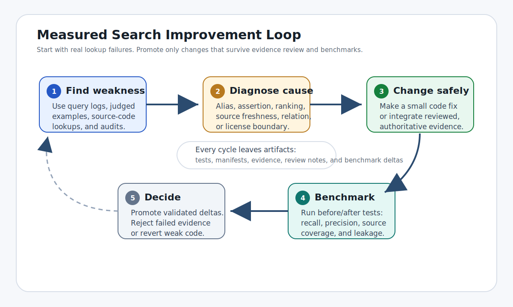
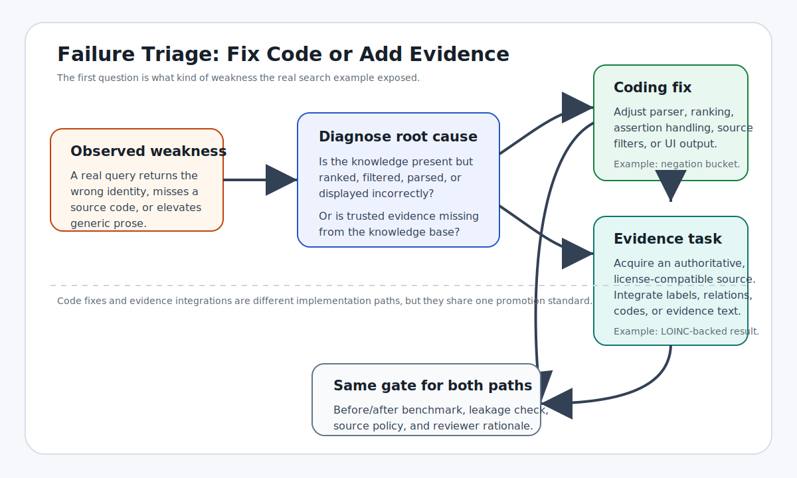
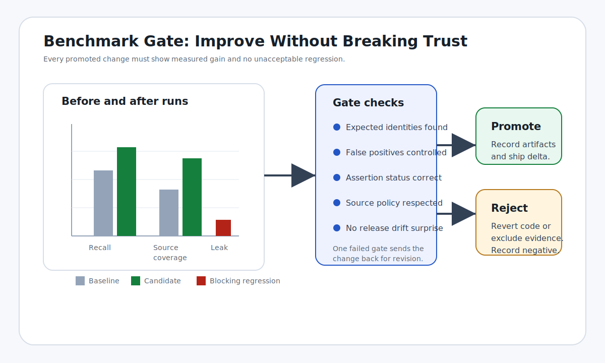

# Testing UMLS With Search, Building UMLS As Search

## Thesis

The most direct way to test whether UMLS is doing its job is to ask it to do
what nearly every downstream user wants to do: search. If a user starts with a
code, acronym, CUI, extracted phrase, abstract, note fragment, or patient
message, can the system reliably surface the right concept, source code, label,
and useful related concepts?

That question is not a secondary convenience feature. It is the operational
test of UMLS value. A vocabulary can preserve identifiers and source labels
perfectly while still failing the task users care about if the right answer is
buried, ambiguous, stale, license-restricted, or outranked by generic prose.

UMLS works best as the canonical biomedical identity and crosswalk layer: CUIs,
source codes, source labels, semantic types, definitions, and source
relationships. The product to build around it is a UMLS-backed biomedical search
service: a system that turns real user language into the right biomedical
identity, with source-backed aliases, relationships, assertion signals,
composition rules, ranking behavior, and evidence.

The proposal is not to replace UMLS. It makes search the primary product
surface and the primary evaluation harness for UMLS improvement. In that model,
new signals enter the product only when they are source-backed, reviewable,
license-compatible, and measurably useful for retrieval.

## Search Is The Product

Most practical UMLS use cases are search with different names. Mapping, NLP,
coding support, terminology lookup, literature discovery, clinical data
integration, cohort building, and annotation all start from some imperfect
input and ask for the right biomedical identity. Sometimes that input is a
string. Sometimes it is a code, acronym, paragraph, extracted span, local label,
or patient phrase. In every case the user needs retrieval.

That makes search both the product and the test. The product is not only a
browser over source vocabularies or a static API that returns exact matches. It
is a ranked, evidence-backed biomedical search layer that answers the question
users actually ask: "given what I have, what biomedical thing is this, and what
else do I need to know about it?"

Search also makes improvement auditable. In this model, every improvement
starts from a measured failure, carries evidence and source policy, and passes
before/after benchmarks before promotion.

## Measured Retrieval Failures

The evaluation was structured around the way users actually use the system:

1. The input was real biomedical language: an abstract, a paragraph, a phrase,
   an acronym, or a mention in context.
2. The UMLS-backed search system returned ranked CUIs, source codes, labels,
   and related concepts.
3. The ranked results were compared with the expected CUIs for that text.
4. Success was counted when the expected answers appeared where a user would
   actually see them, especially rank 1 and the top ten results.

This tests search, not vocabulary coverage. UMLS may already contain the right
concept somewhere, but a user still loses if the search product does not rank
that concept near the top for the words the user actually has.

The current results show the gap between coverage and findability. In the
focused PubMed long-document sample, only 1 of 7 reviewed abstracts had every
expected concept in the top ten results. In the clinically useful MedMentions
mention-context sample, the exact annotated CUI was ranked first 11% of the
time and appeared in the top ten 36% of the time. Because MedMentions uses UMLS
2017AA annotations, some misses may come from release changes rather than pure
search mistakes. That caveat does not change the product point: a successful
UMLS search product makes the expected concept findable from the language users
actually enter.

| Literature example | Observed retrieval failure | Needed search signal |
| ------------------ | -------------------------- | -------------------- |
| `PMID 38307660`: status migrainosus review | Acute-treatment drugs dominated the first page while `status migrainosus` and migraine-with/without-aura concepts fell out. | Disease-state anchors that survive dense treatment lists. |
| `PMID 39951884`: EGFR-mutant NSCLC network meta-analysis | NSCLC, EGFR, and brain metastasis surfaced, but `progression-free survival` and, in the focused run, `osimertinib` fell below the top ten. | Typed outcome, biomarker, drug, and population relationships. |
| `PMID 30945014`: *C. difficile* infection review | `Clostridium difficile infection` ranked first, but `antibiotic-associated diarrhea` and antibiotic exposure were missed or weak. | Exposure-syndrome-organism-treatment links. |
| `PMID 33977794`: lupus-like membranous nephropathy case series | `Pre-eclampsia` and nephrotic-syndrome language ranked high while `systemic lupus erythematosus`, `lupus nephritis`, and `complement C3` fell out. | Disease, renal-pathology, pregnancy, antibody, and complement relationships with assertion context. |
| `PMID 41052480`: first-trimester stroke treated with tenecteplase and thrombectomy | `tenecteplase` ranked first, but `aphasia` and `mechanical thrombectomy` missed the first page. | Context-safe abbreviation and procedure handling for `LVO`, `TNK`, `MT`, symptoms, and interventions. |
| `PMID 32416769`: COVID-19 acute kidney injury management | COVID-19, ARDS, and septic shock surfaced, but `acute kidney injury` dropped out of the first ten. | Organ-complication links for secondary but title-relevant concepts. |
| `PMID 35396752`: CYP2C19 clopidogrel/ticagrelor meta-analysis | The first result was `aspirin`; CYP2C19, clopidogrel, PCI, ticagrelor, and poor-metabolizer concepts were present but not central. | Gene-drug-response edges for metabolizer status, loss-of-function alleles, resistance, and alternative therapy. |
| MedMentions `PMID 27061776`: MRSA pneumonia resource-use study | Full `methicillin-resistant Staphylococcus aureus` mentions linked, but acronym-only `MRSA` rows failed exact retrieval. | Durable acronym aliases that work with or without surrounding abstract context. |
| MedMentions `PMID 27131339`: HERG1 in oral squamous cell carcinoma | `HERG1` and `HERG1 protein` often returned newer or adjacent KCNH2 protein concepts instead of the annotated 2017AA CUI. | Gene/protein synonym, product, and release-drift handling. |

## Gap Classes

This paper uses "missing" in four practical senses: the concept itself may be
missing; a concept may exist but common wording is weak; relationships may be
too generic for retrieval; or a public deployment may be unable to use a
restricted source vocabulary. The important gap classes are:

| Gap class | Retrieval problem | Examples | Needed signal |
| --------- | ----------------- | -------- | ------------- |
| Clinical shorthand | Common note or abstract language misses or overmatches without context. | `HFrEF`, `NSTEMI`, `AFib`, `DKA`, `PHQ-9`, `INR`, `NSCLC`, `RA` | Context-scoped aliases and blocked meanings. |
| Term-form variants | Professional, adjectival, lay, and organ-name variants fail to bridge reliably. | `hepatic` / `liver`, `renal` / `kidney`, `pulmonary` / `lung`, `cardiac` / `heart` | Evidence-backed lexical bridges, not unconditional synonyms. |
| Composite findings | Clinically meaningful phrases split into generic parts. | `bibasilar crackles`, `right heart strain`, `exposed bone`, `epileptiform discharges`, `suppressed TSH` | Phrase anchors or composition rules with semantic constraints. |
| Lab and result phrases | Coded observations exist, but prose results combine observation, value, interpretation, organism, and trend. | `urine culture grew E. coli`, `low ferritin`, `rising creatinine`, `blood glucose was 38 mg/dL` | LOINC-backed observation anchors plus result-state parsing. |
| Procedure coverage | Users search specific procedure phrases, but CPT and some source descriptors cannot be the backbone of an open product. | `right heart catheterization`, `incision and drainage`, `ultrasound-guided central venous catheter placement` | Allowed procedure sources plus action/anatomy/modality/device composition; private adapters for licensed deployments. |
| Assertion and currentness | Negated, historical, planned, copied-forward, family-history, or uncertain mentions rank like active problems. | `no evidence of right heart strain`, `bone biopsy planned`, old medication lists | Mention status buckets and current-versus-history ranking. |
| Patient and workflow language | Portal prose and chart metadata can outrank biomedical content. | `I am confused`, `instructions`, `result`, `problem`, `scheduling`, `unknown` | Generic role metadata and suppression/demotion rules. |
| Emerging domains | Release cadence and source integration lag fast-moving clinical language. | pharmacogenomics, oncology variants, resistance patterns, taxonomy updates, device safety | Source-delta checks, direct refreshed slices, and provisional reviewed edges. |

## Improvement Loop

Because search is the product, improvement begins with failed searches rather
than abstract coverage wish lists. The loop has six stages:

1. A measured retrieval failure.
2. Cause classification: alias gap, generic-concept problem, assertion problem,
   missing relationship, source-ingestion issue, ranking bug, source drift, or
   license boundary.
3. The smallest source-backed change: code fix, ranking fix, reviewed alias,
   typed edge, composition rule, source update, or deployment adapter.
4. Candidate, relation, provenance, manifest, and before/after benchmark
   artifacts.
5. Automated checks for recall, precision, false positives, source drift,
   restricted-content leakage, and operational repeatability.
6. Promotion for validated deltas; deferral for weak, duplicate, badly bounded,
   or license-restricted candidates.

## Search Product Design

A UMLS search product keeps the canonical UMLS identity layer intact and adds
the retrieval signals needed to make it useful in real workflows:

The product promise is straightforward: users bring the language they have, and
the service returns the best biomedical identities, explains why they matched,
and avoids confusing generic terms, stale labels, restricted content, or
contextually wrong answers with the right result.

| Layer | Purpose |
| ----- | ------- |
| Identity backbone | CUIs, source codes, semantic types, definitions, and source relationships remain the stable foundation. |
| Safe aliases and lexical variants | Reviewed labels, acronyms, lay terms, spelling variants, and adjectival/organ bridges include required and blocked context. |
| Typed relationships | Treatment, indication, complication, diagnostic evidence, phenotype, adverse event, procedure target, organism, gene, and pharmacogenomic response have distinct relationship types. |
| Composition | Action, target anatomy, laterality, modality, device, specimen, result state, severity, and temporal status are represented when they affect retrieval. |
| Assertion and status | Current, historical, negated, uncertain, planned, family-history, and confirmed mentions remain in separate ranking buckets. |
| Provenance and source policy | Evidence source, confidence, review status, source dates, release metadata, and license constraints are tracked for every promoted alias, edge, or provisional concept. |
| Generic role metadata | Valid but poor standalone answers such as `Result`, `Instructions`, `Problem`, `Unknown`, `Placement`, and `Therapeutic procedure` are marked explicitly. |

These signals are not requests for an LLM to invent biomedical knowledge. LLM
coding assistants can inspect failures, localize causes, prepare candidates,
modify code, and run tests, but promotion still requires source evidence,
query-pressure evidence, reviewer rationale, and validation output.

## Evidence Sources

The useful organizing question is: what search signal is missing? Some inputs
are structured terminologies; others are natural-language sources that vector
search can use as evidence. For vocabularies UMLS already carries, the goal is
not to duplicate the feed; it is to expose refreshed slices, native xrefs,
hierarchy, and licensed adapters when they improve retrieval.

| Missing signal | Candidate evidence sources |
| ------------- | -------------------------- |
| Disease labels, xrefs, hierarchy, and relationships not already covered by UMLS | MONDO and permitted disease reference sources. |
| Variant, biomarker, and pharmacogenomic relationships | ClinGen, CIViC, CPIC, and similar curated resources where source policy permits. |
| Gene and protein search language | Literature-derived mentions, protein-name usage examples, oncology biomarker text, and permitted genetics references. |
| Drug indications, warnings, and therapeutic-neighbor relationships | Full drug-label text, FDA safety communications, prescribing guidance, and permitted drug references. |
| Organism names, strain names, and pathogen language | CDC pages, public outbreak/surveillance pages, and specialist taxonomy resources where reuse terms permit. |
| Procedure lookup and composition | Allowed procedure sources, procedure-note examples, local procedure dictionaries, device references, and licensed adapters where permitted. |
| Natural-language phrasing and relationship evidence | FDA communications, CDC pages, clinical guidelines, open-access reviews, PubMed/PMC literature where permitted, and ClinicalTrials.gov posted records. |
| Real-world failure and validation evidence | Judged paragraph tests, patient-message examples, reviewed query logs, licensed clinical notes, coding workflows, and source-delta reports. |

Vector search makes natural-language evidence practical because it can retrieve
source sentences and paragraphs even when wording differs. Vector matches supply
candidate evidence, not final truth: lexical matches, CUIs, source codes,
provenance, source policy, tests, and review decide whether a candidate becomes
a promoted alias, relationship, ranking rule, or provisional concept.

## Prior Work And Why Now

NLM and Lister Hill have worked on pieces of this problem for years. MetaMap
mapped biomedical text to UMLS concepts; SemRep and SemMedDB extracted and
stored semantic predications; SPECIALIST Lexicon/LVG, MetamorphoSys, the UMLS
Browser/API, PubMed Automatic Term Mapping, MeSH indexing, and the Medical Text
Indexer all addressed parts of the same job: connect biomedical strings,
concepts, codes, documents, and relationships.

The lesson is still valid, but the validation target becomes more explicit:
does UMLS get users to the right CUI, code, and string from the language they
actually have? Search logs, judged query sets, public literature, source-delta
manifests, vector retrieval, LLM-assisted engineering, and continuous tests now
make a tight measured loop cheaper to run and maintain.

## Prototype Evidence

A paired 167-paragraph evaluation compared a UMLS-only label/code baseline with
the current search layer on the same queries. This is a prototype benchmark,
not a final claim about every UMLS deployment, but it shows the kind of
measurable improvement the process is meant to produce.

| Check | UMLS-only baseline | Current prototype |
| ----- | ------------------ | ----------------- |
| Paragraphs judged good | 78/167 | 148/167 |
| Expected CUI recall@10 | 88.1% | 96.4% |
| Queries with all expected CUIs@10 | 90/167 | 144/167 |
| Top result clinically on target | 82.6% | 95.2% |
| Strict success@10 | 45.5% | 82.0% |

The gains came from evidence-backed vector retrieval, active-label supplements,
accepted alternatives, acronym handling, assertion handling, generic-prose
demotion, lab/result ranking, procedure composition, and repeatable regression
checks.

## Near-Term Work

| Priority | Product requirement |
| -------- | ---- |
| Literature recall | Long-document section/chunk merge and reranking that keep secondary treatments, outcomes, biomarkers, organisms, and complications in the first result window. |
| Ambiguous abbreviations | Context-safe aliases for common clinical and literature short forms such as `RA`, `LVO`, `TNK`, `MT`, `NSCLC`, and `MRSA`. |
| Composite findings and procedures | Reviewed phrase promotion or composition for phrases such as `right heart strain`, `bibasilar crackles`, `suppressed TSH`, and `ultrasound-guided central venous catheter placement`. |
| Lab/result statements | LOINC-backed observations connected to prose values, interpretations, organisms, and trends. |
| Relationship expansion | Typed treatment, indication, complication, diagnostic, phenotype, organism, gene, and pharmacogenomic edges. |
| Assertion semantics | Separate ranking behavior for current, negated, historical, planned, uncertain, and family-history mentions. |
| Quality gates | Standing clinical smoke, literature lanes, precision audits, source-delta checks, and long-document heldout tests in the promotion path. |

## Governance And Risks

| Risk or question | Control |
| ---------------- | ---------------- |
| Source licensing may limit what a public product can use. | Public, restricted, and licensed deployment artifacts remain separate; source policy is recorded with every promoted alias, relation, and evidence record. |
| A benchmark can look good because the system was tuned to familiar examples. | Heldout query sets rotate, source-specific tests are added, long-document tests remain in place, and precision is audited alongside recall. |
| Added aliases or relationships can create false positives. | Small deltas, direct-query tests, paragraph-context tests, and rollback artifacts limit the blast radius. |
| Natural-language evidence can drift or disappear. | Source manifests, dates, hashes, and source-delta checks support re-review when sources change materially. |
| Clinical notes and local workflow data can improve search but create privacy and redistribution risks. | Licensed or local clinical data stays inside the permitted deployment; raw notes and protected derived artifacts are not published. |
| The line between UMLS content and search-layer content needs governance. | Provisional concepts, promoted aliases, ranking rules, and evidence records remain visibly separate from official source vocabularies until a review path promotes them. |
| Promotion ownership can be ambiguous. | Ownership is divided across search quality, domain meaning, and release control: a search-quality owner approves metric movement and smoke-gate results; a domain reviewer approves clinical meaning and source evidence for aliases, relationships, and provisional concepts; a release owner approves licensing, artifact separation, rollback, and public/private deployment boundaries. LLM-assisted review can prepare evidence and diffs, but cannot be the final approver. |
